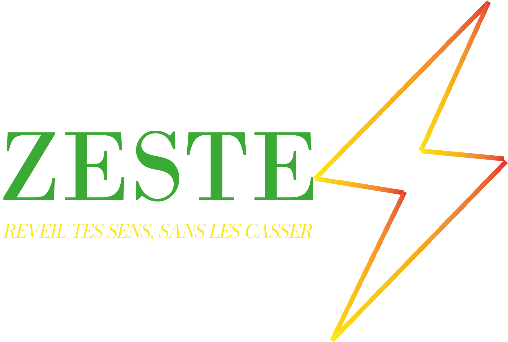

<!DOCTYPE html>
<html lang="fr">
<head>
    <meta charset="UTF-8">
    <meta name="viewport" content="width=device-width, initial-scale=1.0">
    <title>Zeste Energy - Officiel</title>
    
</head>
<body>

    <header>
        
    </header>

    <section class="hero">
        
promotion de lancement exclusive de la marque zeste !

        <h1>Réveille tes sens , sans les casser</h1>
        

            Zeste est la boisson énergisante conçue pour booster ton énergie naturellement. 
        

    </section>

    

        

            

                <h3>⚡ Énergie Rapide</h3>
                
Un coup de boost immédiat pour vos journées intenses.

            

            

                <h3>🍃 Goût Frais</h3>
                
Une saveur unique qui désaltère en profondeur.

            

        

        

            <h2 style="color: var(--brand-yellow);">Promotions de Lancement de la boisson zeste</h2>
            
1 ACHETÉE = LA 2ÈME À -50%

            <a href="#" class="cta-button">participez à la promotion dès maintenant</a>
        

    

    <footer>
        
Instagram: @zeste.energy | WhatsApp: +237 689 758 471

        
*À consommer avec modération.

    </footer>

</body>
</html>
